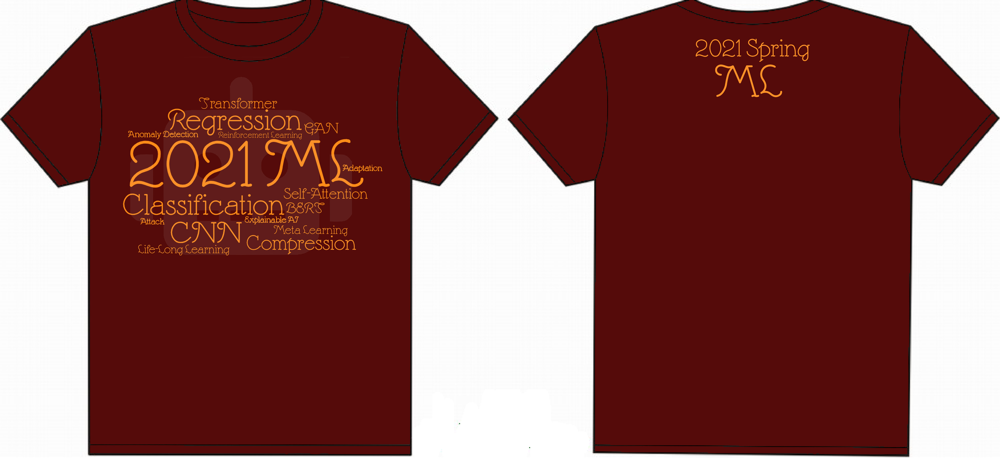

# Machine Learning 2021 

Machine Learning (NTU EE 5184, Spring 2021)

Instructor: Hung-yi Lee

Course Website : (https://speech.ee.ntu.edu.tw/~hylee/ml/2021-spring.html)

---

## Homeworks
|#|Homework|Public score|Private Score|Score|Ranking*
|-|-|-|-|-|-|
|1|Regression|0.87985|0.91099|9|Top 35% (709/2032)
|2|Classification|0.76324| 0.76319|10.5 |Top 5% (59/1522)
|3|CNN|0.83094|0.82546|10.5|Top 7% (87/1404)
|4|Self-Attention|0.96857|0.96888|10.5|Top 7% (81/1170)
|5|Transformer|33.53|32.27|10.5 | Top 1% (11/1110)
|6|GAN|(0.688, 7722.47)|NA|10.5 |Top 41% (405/1118)
|7|BERT|0.85926|0.85157|10.5|Top 4% (39/1263)
|8|Anomaly Detection|0.90118|0.89286|10.5|Top 9% (104/1193)
|9|Explainable AI|NA|NA|9.7|NA|
|10|Attack|0.010|0.010|10.5|Top 14% (154/1162)
|11|Adaptation|0.78806|0.78744|10|Top 26% (268/1061)
|12|RL|287|NA|10.5|Top 2% (10/766)
|13|Compression|0.75686|0.75493|9.5|Top 19% (109/590)
|14|Life-Long Learning|NA|NA|9.2|NA
|15|Meta Learning|NA|NA|10|NA

*Ranking is based on private leaderboard

---

# Viewing Jupyter notebook

Sometimes the error message "Sorry, something went wrong. Reload?" appears when viewing `*.ipynb` on a GitHub.

We recommend using nbviewer to view the `*.ipynb` files

Simply copy the URL of this repository to https://nbviewer.jupyter.org/

# Download Google Drive files with WGET

Example of a Google Drive download link (HW3 data):
`https://drive.google.com/file/d/1awF7pZ9Dz7X1jn1_QAiKN-_v56veCEKy/view`

The url has the following format 
`https://drive.google.com/file/d/[ID]/view`

Copy the ID and run the script `wgetgdrive.sh` as follows

```
chmod 777 ./wgetgdrive.sh
./wgetgdrive.sh [ID] [file_name]
```

For example, to download the data of HW3 and name it as `food-11.zip`, simply run the following 

```
chmod 777 ./wgetgdrive.sh
./wgetgdrive.sh 1awF7pZ9Dz7X1jn1_QAiKN-_v56veCEKy food-11.zip
```

# Achievement
I finish the 15 assignments with all scores above 9 pts and win a T-shirt as a prize. Only the **top 2% (16/1280)** students own such an achievement.
<p align="center">

</p>